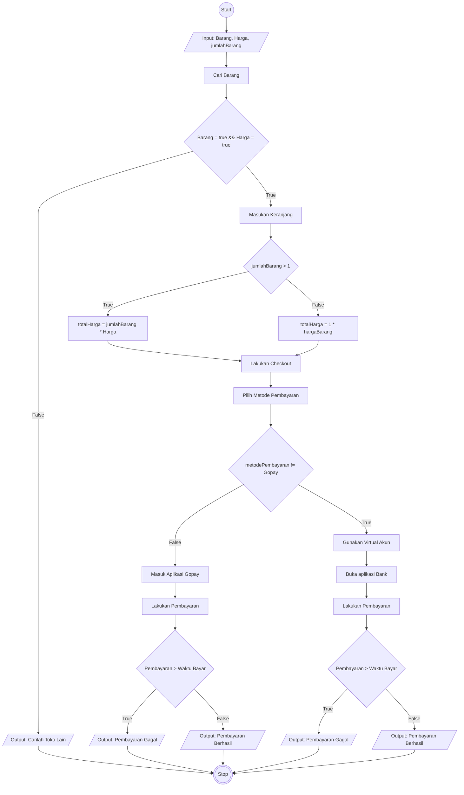

# Algoritma Checkout Tokopedia

## Deskriptif
1. Start
2. Carilah barang yang akan dibeli di Tokopedia
3. Lalu pilih lah produk yang akan dibeli di Tokopedia
4. Sesuaikan dengan ukuran dan warna barang yang akan dibeli
5. Jika spesifikasi yang ingin dibeli tidak ada, maka cari dari toko lain
6. Jika barang yang diinginkan sesuai dengan spesifikasi, Masukan keranjang untuk barang yang akan dibeli
7. Masukan keranjang terhadap barang yang sudah sesuai dengan spesifikasi
8. Jika barang lebih dari 1 maka kalikan jumlah barang dengan harga barang
8. Pilih metode pembayaran yang akan digunakan
9. Jika user membayar melalui gopay, maka akan di arahkan ke aplikasi gopay untuk melakukan pembayaran
10. Jika pada saat di gopay saldo nasabah tidak cukup maka pembayaran gagal
11. Jika berhasil maka akan muncul pembayaran sukses
12. Jika user membayar melalui virtual account bank maka akan diberikan kode pembayaran 
13. Jika kode pembayaran tersebut belum dibayarkan sesuai dari waktu yang ditentukan maka pembayaran gagal
14. Jika kode pembayaran tersebut dibayarkan sesuai dari waktu yang ditentukan maka pembayaran berhasil
15. Finish

## Flowchart

