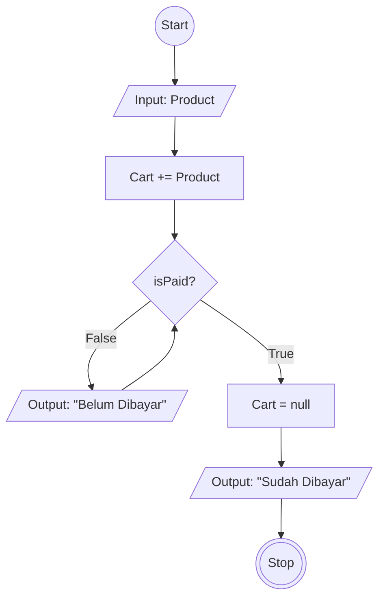

# Algoritma Checkout Tokopedia

## Deskriptif
1. Start
2. Pilihlah barang yang akan di checkout
3. Masukan barang yang akan di checkout kedalam keranjang
4. Lakukan lah pembayaran terhadap barang yang akan di checkout
5. Jika pembayaran sudah dilakukan maka cart akan kosong dan muncul status sudah dibayar
6. Jika pembayaran tidak dilakukan maka akan muncul status belum dibayar
7. Finish

## Flowchart

