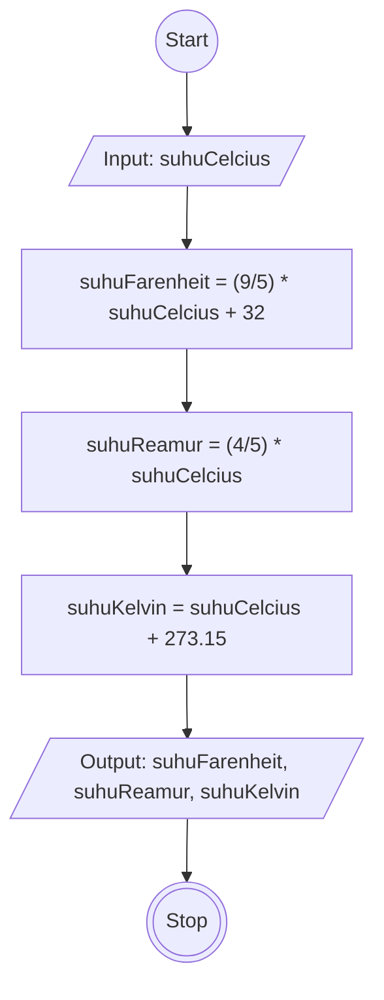

# Algoritma Program Konversi Suhu

## Deskriptif

1. Mulai
2. Siapkan lah sebuah input dalam bentuk celcius
3. Lalu mulai lah konversi ke farenheit dengan menggunakan rumus farenheit yaitu 9 per 5 dikali derajat celcius nya ditambah 32 derajat
4. Lalu lakukan lah konversi celcius ke reamur dengan menggunakan rumus reamur yaitu 4 per 4 dikali derajat celcius nya
5. Lalu lakukan lah konversi dari celcius ke kelvin dengan menggunakan rumus kelvin yaitu derajat celcius ditambah 273.15 derajat
6. Setelah itu tampilkan hasil konversi dari farenheit, reamur, dan kelvin
7. Selesai

## Flowchart

