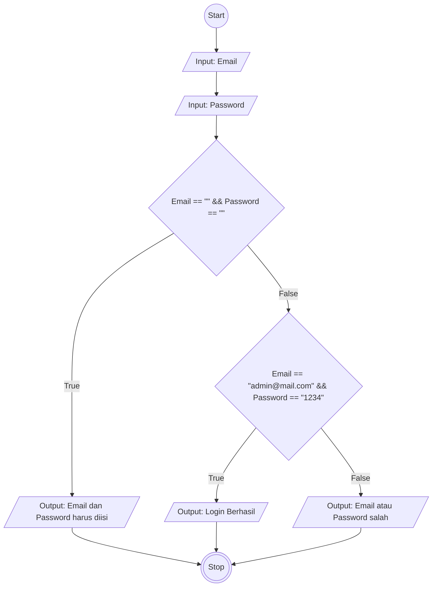

```mermaid
flowchart TD
id1(("Start"))
idEmail[/"Input: Email"/]
idPassword[/"Input: Password"/]
id2{"Email == #quot;#quot; && Password == #quot;#quot;"}
output1[/"Output: Email dan Password harus diisi"/]
id3{"Email == #quot;admin@mail.com#quot; && Password == #quot;1234#quot;"}
output2[/"Output: Login Berhasil"/]
output3[/"Output: Email atau Password salah"/]
id4(((Stop)))

id1 --> idEmail --> idPassword --> id2
id2 -- True --> output1
id2 -- False --> id3
id3 -- True --> output2
id3 -- False --> output3
output1 --> id4
output2 --> id4
output3 --> id4
```