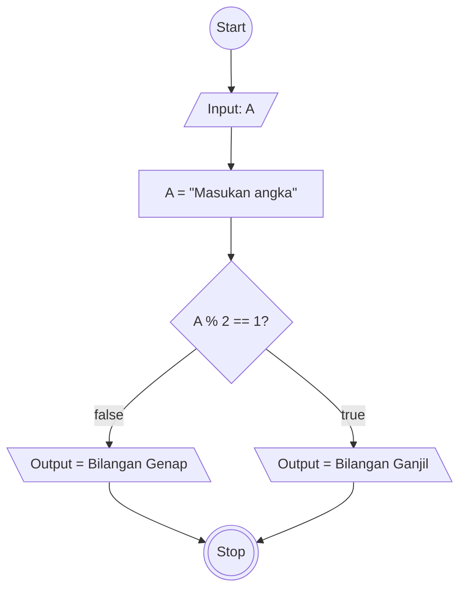

```mermaid
flowchart TD
    id1((Start))
    id2[/"Input: A"/]
    id3["A = #quot;Masukan angka#quot;"]
    id4{A % 2 == 1?}
    id5[\Output = Bilangan Genap\]
    id6[\Output = Bilangan Ganjil\]
    id7(((Stop)))


    id1 --> id2 --> id3 --> id4 -- false --> id5
    id4 -- true --> id6
    id5 & id6 --> id7
```