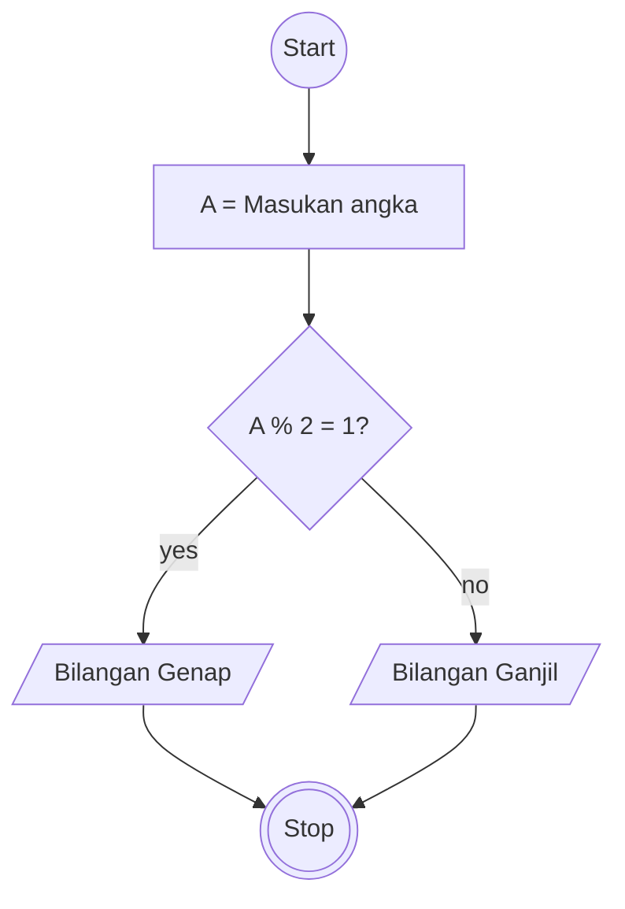

```mermaid
flowchart TD
    id1((Start))
    id3["A = Masukan angka"]
    id4{A % 2 = 1?}
    id5[/Bilangan Genap/]
    id6[/Bilangan Ganjil/]
    id7(((Stop)))


    id1 --> id3 --> id4 -- yes --> id5
    id4 -- no --> id6
    id5 & id6 --> id7

```