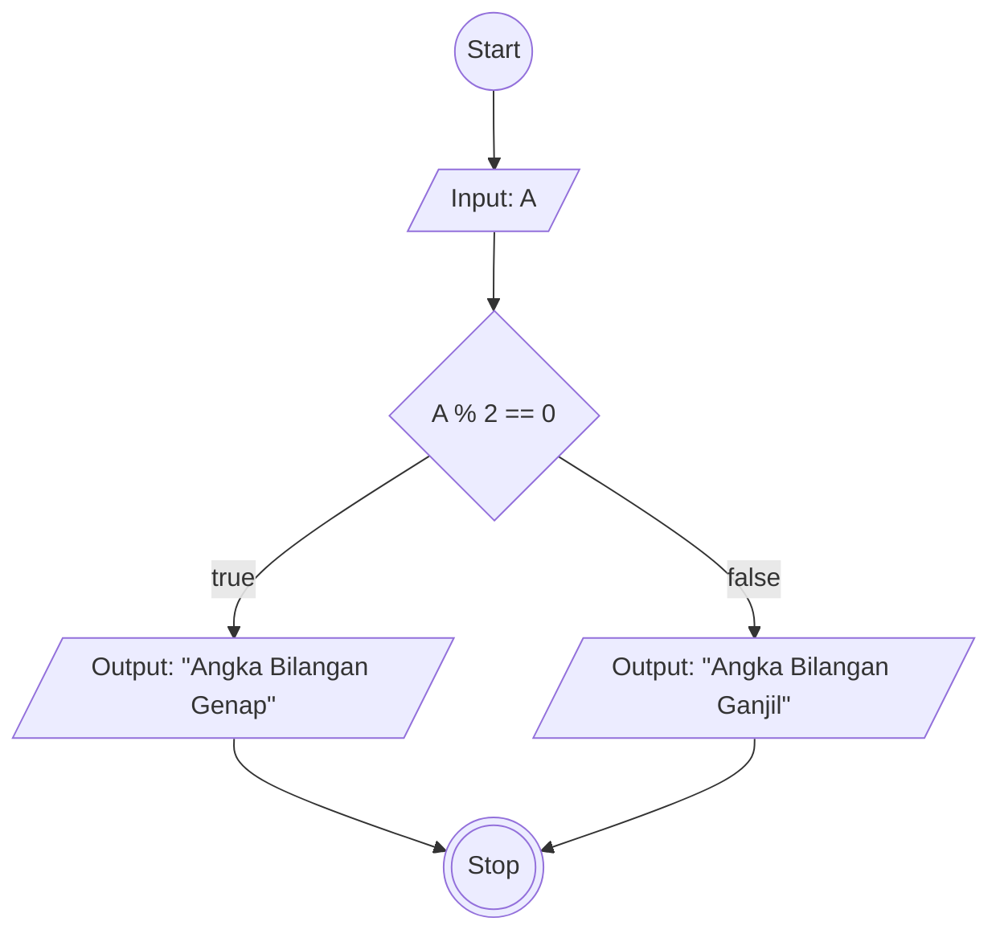

```mermaid
flowchart TD
    id1((Start))
    id2[/"Input: A"/]
    id4{A % 2 == 0}
    id5[/Output: #quot;Angka Bilangan Genap#quot;/]
    id6[/Output: #quot;Angka Bilangan Ganjil#quot;/]
    id7(((Stop)))


    id1 --> id2 --> id4 -- true --> id5
    id4 -- false --> id6
    id5 & id6 --> id7
```