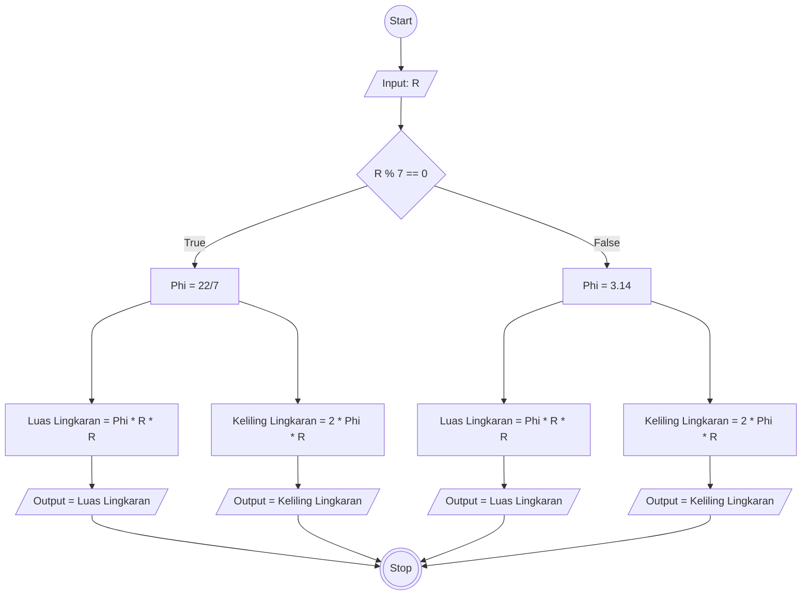

```mermaid
    flowchart TD
    id1((Start))
    id2[/"Input: R"/]
    id3{R % 7 == 0}
    id4["Phi = 22/7"]
    id5["Phi = 3.14"]
    id6["Luas Lingkaran = Phi * R * R"]
    id7["Keliling Lingkaran = 2 * Phi * R"]
    id8["Luas Lingkaran = Phi * R * R"]
    id9["Keliling Lingkaran = 2 * Phi * R"]
    id10[/"Output = Luas Lingkaran "/]
    id11[/"Output = Keliling Lingkaran "/]
    id12[/"Output = Luas Lingkaran "/]
    id13[/"Output = Keliling Lingkaran "/]
    id14(((Stop)))

    id1 --> id2 --> id3
    id3 -- True --> id4
    id3 -- False --> id5
    id4 ----> id6
    id4 ----> id7
    id5 ----> id8
    id5 ----> id9
    id6 --> id10
    id7 --> id11
    id8 --> id12
    id9 --> id13
    id10 --> id14
    id11 --> id14
    id12 --> id14
    id13 --> id14
```