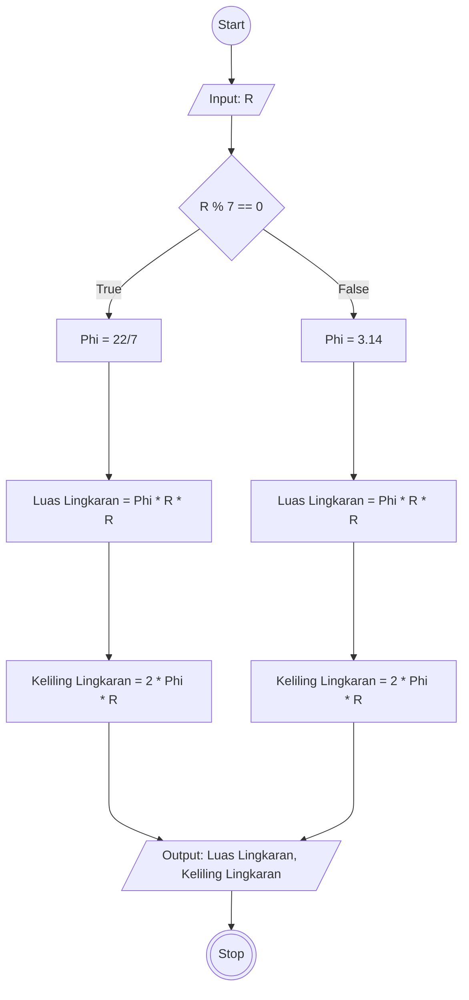

```mermaid
    flowchart TD
    id1((Start))
    id2[/"Input: R"/]
    id3{R % 7 == 0}
    id4["Phi = 22/7"]
    id5["Phi = 3.14"]
    id6["Luas Lingkaran = Phi * R * R"]
    id7["Keliling Lingkaran = 2 * Phi * R"]
    id8["Luas Lingkaran = Phi * R * R"]
    id9["Keliling Lingkaran = 2 * Phi * R"]
    id11[/"Output: Luas Lingkaran, Keliling Lingkaran "/]
    
    id14(((Stop)))

    id1 --> id2 --> id3
    id3 -- True --> id4
    id3 -- False --> id5
    id4 ----> id6
    id6 ----> id7
    id5 ----> id8
    id8 ----> id9
    id7 ----> id11
    id9 ----> id11
    id11 --> id14
```